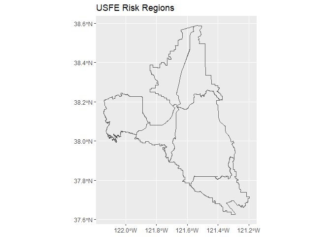
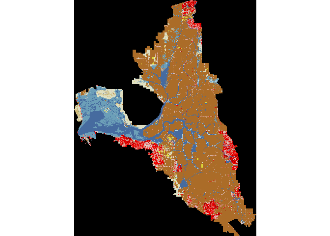

<br>

<details>
  <summary><b>Required Libraries</b></summary>

```r
#devtools::install_github("WWU-IETC-R-Collab/IETC")
library(IETC)

#devtools::install_github("ropensci/FedData") # Use Fed Data Version 3.0.0 or higher. CRAN has 2.5.7
library(FedData)

library(rgdal) # R geoprocessing tools
```

```
## Warning: package 'rgdal' was built under R version 4.0.5
```

```
## Loading required package: sp
```

```
## rgdal: version: 1.5-23, (SVN revision 1121)
## Geospatial Data Abstraction Library extensions to R successfully loaded
## Loaded GDAL runtime: GDAL 3.2.1, released 2020/12/29
## Path to GDAL shared files: C:/Users/Erika/Documents/R/win-library/4.0/rgdal/gdal
## GDAL binary built with GEOS: TRUE 
## Loaded PROJ runtime: Rel. 7.2.1, January 1st, 2021, [PJ_VERSION: 721]
## Path to PROJ shared files: C:/Users/Erika/Documents/R/win-library/4.0/rgdal/proj
## PROJ CDN enabled: FALSE
## Linking to sp version:1.4-5
## To mute warnings of possible GDAL/OSR exportToProj4() degradation,
## use options("rgdal_show_exportToProj4_warnings"="none") before loading rgdal.
## Overwritten PROJ_LIB was C:/Users/Erika/Documents/R/win-library/4.0/rgdal/proj
```

```r
library(raster) # Raster data manipulation
```

```
## Warning: package 'raster' was built under R version 4.0.5
```

```r
library(sf) # vector data manipulation
```

```
## Linking to GEOS 3.8.0, GDAL 3.0.4, PROJ 6.3.1
```

```r
library(tidyverse)
```

```
## -- Attaching packages --------------------------------------- tidyverse 1.3.0 --
```

```
## v ggplot2 3.3.3     v purrr   0.3.4
## v tibble  3.0.5     v dplyr   1.0.3
## v tidyr   1.1.2     v stringr 1.4.0
## v readr   1.4.0     v forcats 0.5.0
```

```
## -- Conflicts ------------------------------------------ tidyverse_conflicts() --
## x tidyr::extract() masks raster::extract()
## x dplyr::filter()  masks stats::filter()
## x dplyr::lag()     masks stats::lag()
## x dplyr::select()  masks raster::select()
```
</details>
<br>

<details>
  <summary><b>Functions and Class Key</b></summary>

```r
# Function to Tabulate raster::extract() Output by Polygon
# http://zevross.com/blog/2015/03/30/map-and-analyze-raster-data-in-r/
tabFunc <- function(indx, extracted, region, regname) {
  dat<-as.data.frame(table(extracted[[indx]]))
  dat$name<-region[[regname]][[indx]]
  return(dat)
}

# Function for converting pixel count to square kilometers
pc2sqkm <- function(x, in_raster) {
  apc <- prod(raster::res(in_raster))
  x * apc / 1e+6
}

# Create NLCD Class Key
# Based on: https://www.mrlc.gov/data/legends/national-land-cover-database-2016-nlcd2016-legend
NLCD.class <- c('OpenWater' = '11',
                'PerennialIceSnow' = '12',
                'DevOpenSpace' = '21',
                'DevLowInt' = '22',
                'DevMedInt' = '23',
                'DevHighInt' = '24',
                'BarrenLand' = '31',
                'DeciduousForest' = '41',
                'EvergreenForest' = '42',
                'DwarfShrub' = '51',
                'ShrubScrub' = '52',
                'GrassHerb' = '71',
                'SedgeHerb' = '72',
                'Lichens' = '73',
                'Moss' = '74',
                'PastureHay' = '81',
                'CultivatedCrops' = '82',
                'WoodyWetlands' = '90',
                'EmergentHerbWetlands' = '95'
                )
```

</details>

<br>

## Load Data

- USFE Risk Regions (shapefile, datum = WGS 84)
- MRLC NLCD 2016 Land Cover (CONUS)


```r
# Load Risk Regions
  USFE.riskregions.z <- "https://github.com/WWU-IETC-R-Collab/CEDEN-mod/raw/main/Data/USFE_RiskRegions_9292020.zip"
  USFE.riskregions <- IETC::unzipShape(USFE.riskregions.z) # loads GitHub zipped shapefile as an sf object
```

```
## Reading layer `RiskRegions_DWSC_Update_9292020' from data source `C:\Users\Erika\AppData\Local\Temp\RtmpIF0m1u\file1ce4279426b2\RiskRegions_DWSC_Update_9292020.shp' using driver `ESRI Shapefile'
## Simple feature collection with 6 features and 6 fields
## geometry type:  POLYGON
## dimension:      XYZ
## bbox:           xmin: -122.1431 ymin: 37.62499 xmax: -121.1967 ymax: 38.58916
## z_range:        zmin: 0 zmax: 0
## geographic CRS: WGS 84
```

```r
  # Visualize
  ggplot() +
    geom_sf(data = USFE.riskregions, fill = NA) +
    ggtitle("USFE Risk Regions")
```

<!-- -->

```r
  tibble(USFE.riskregions)
```

```
## # A tibble: 6 x 7
##   Subregion area_km2 area_hecta are_mi2 Shape_Leng Shape_Area
##   <chr>        <dbl>      <dbl>   <dbl>      <dbl>      <dbl>
## 1 Suisun B~      464      46400     179       1.53     0.0477
## 2 South De~      421      42100     163       1.67     0.0430
## 3 Sacramen~      536      53600     207       1.54     0.0545
## 4 North De~      448      44800     173       1.53     0.0470
## 5 Confluen~      285      28500     110       1.26     0.0292
## 6 Central ~     1286     128600     497       2.04     0.132 
## # ... with 1 more variable: geometry <POLYGON [°]>
```

```r
# Load Land Use Data using FedData
# Alternative NLCD data at mrlc.gov/viewer using the following extent

# Latitude dd: 36.75543, 38.92584
# Longitude dd: -123.72037, -120.52298
# https://www.mrlc.gov/viewer/?downloadBbox=36.75543,38.92584,-123.72037,-120.52298

# Get the NLCD (USA ONLY)
# Returns a raster
USFE.NLCD <- get_nlcd(template = USFE.riskregions,
                 year = 2016,
                 dataset = "Land_Cover",
                 label = "USFE")
```

```
## Warning in showSRID(uprojargs, format = "PROJ", multiline = "NO", prefer_proj =
## prefer_proj): Discarded ellps WGS 84 in Proj4 definition: +proj=merc +a=6378137
## +b=6378137 +lat_ts=0 +lon_0=0 +x_0=0 +y_0=0 +k=1 +units=m +nadgrids=@null
## +wktext +no_defs +type=crs
```

```
## Warning in showSRID(uprojargs, format = "PROJ", multiline = "NO", prefer_proj =
## prefer_proj): Discarded datum World Geodetic System 1984 in Proj4 definition
```

```r
# raster::plot(USFE.NLCD, main = "NLCD Data, 2016")

# Transform Risk Regions to match raster data
USFE.riskregions.NLCD <- as_Spatial(st_zm(USFE.riskregions)) %>%
  spTransform(crs(USFE.NLCD))

# Mask Study Area
USFE.NLCD.mask <- raster::mask(USFE.NLCD, USFE.riskregions.NLCD)

# Check Plot with raster::plot
raster::plot(USFE.NLCD.mask, main = "2016 NLCD within \n USFE Risk Regions")
```

<!-- --><!-- -->

## Tabulating NLCD by Risk Region in R


```r
# Extract Raster Values
USFE.LULC <- raster::extract(USFE.NLCD.mask, USFE.riskregions.NLCD) # be patient, this takes a while

# Tabulate raster::extract() lists

USFE.LULC.tabulated <- lapply(seq(USFE.LULC),
        tabFunc, USFE.LULC,USFE.riskregions.NLCD,
        "Subregion") %>% # tabulate result lists from raster::extract
  do.call("rbind", .) %>% # combine the tabulated raster::extract
  pivot_wider(names_from = Var1, # pivot classes wide
              values_from = Freq) %>%
  dplyr::select(name, any_of(NLCD.class)) %>% # replace column class ID # with class name
  mutate(across(where(is.numeric), ~pc2sqkm(., USFE.NLCD.mask))) # convert pixel counts to sq km

# Format table for next uses

USFE.LULC.tabulated <- USFE.LULC.tabulated %>%
    rename(Subregion = name) %>%
    replace(is.na(.), 0) %>%
    mutate(TotKm = rowSums(.[,-1])) %>% # calculate total km of subregion land use classes
    mutate(PercHighIntens = 100*DevHighInt/TotKm) %>%
    mutate(PercAgri = 100*CultivatedCrops/TotKm)
  

# Write Final Table to Outputs
write_csv(USFE.LULC.tabulated, "Output/NLCD_LULC.csv")
```


